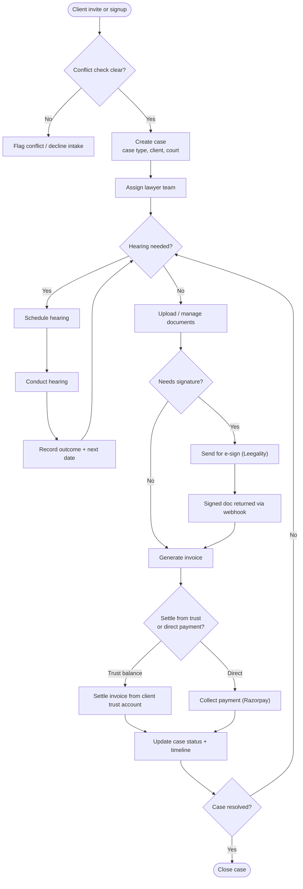
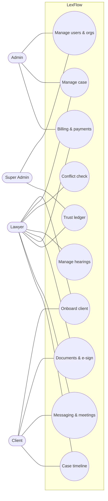
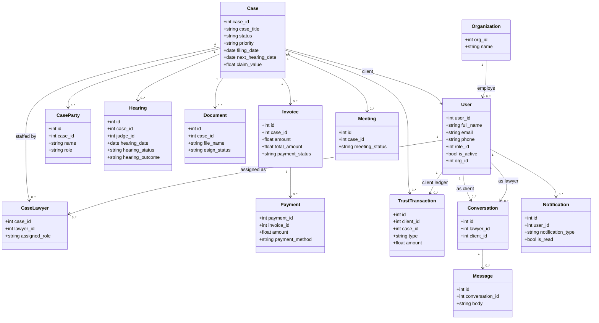
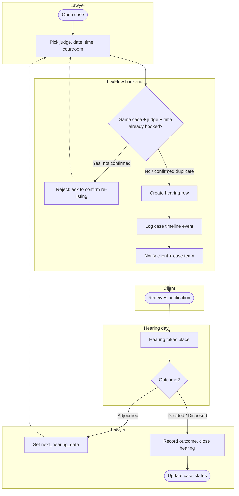
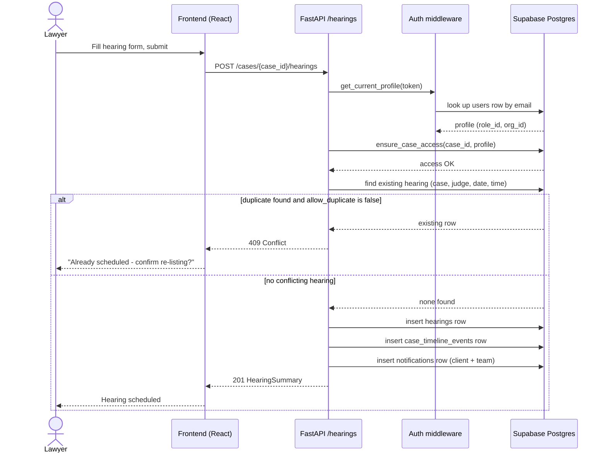
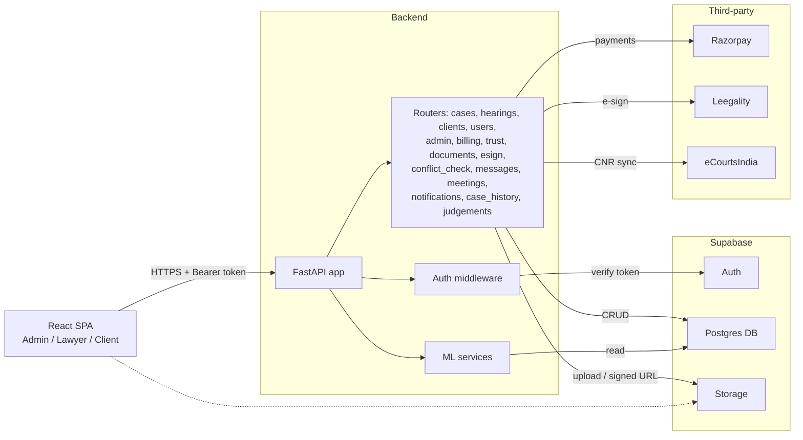

# LexFlow — System Diagrams

Six standard views of the platform: React frontend, FastAPI backend, Supabase, and the
Razorpay / Leegality / eCourtsIndia integrations.

## 1. Flowchart — case lifecycle

## 2. Use case diagram — actors and capabilities

## 3. Class diagram — core domain model

## 4. Activity diagram — schedule & conduct a hearing

## 5. Sequence diagram — schedule hearing request

## 6. Component diagram — system architecture

