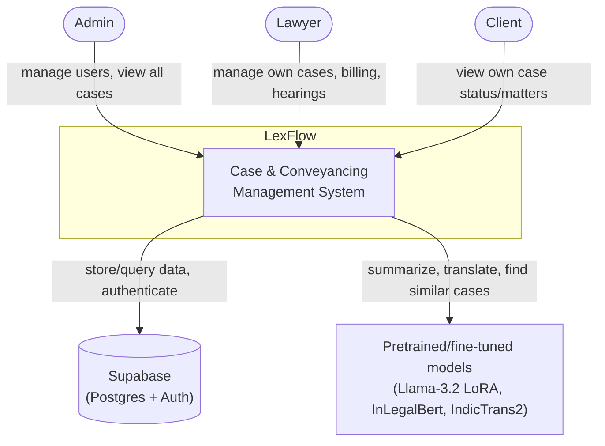
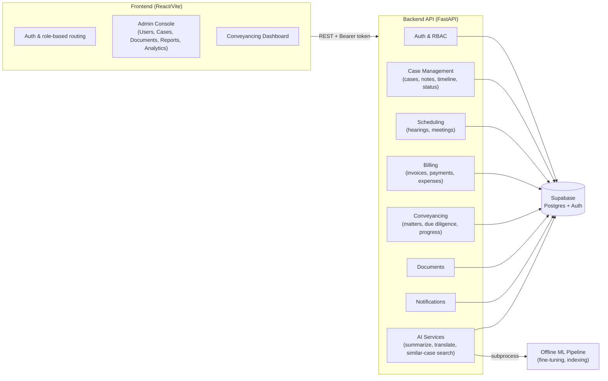
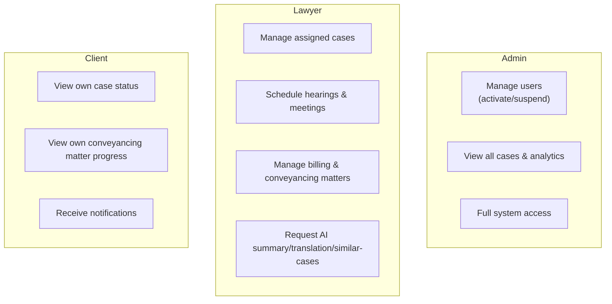
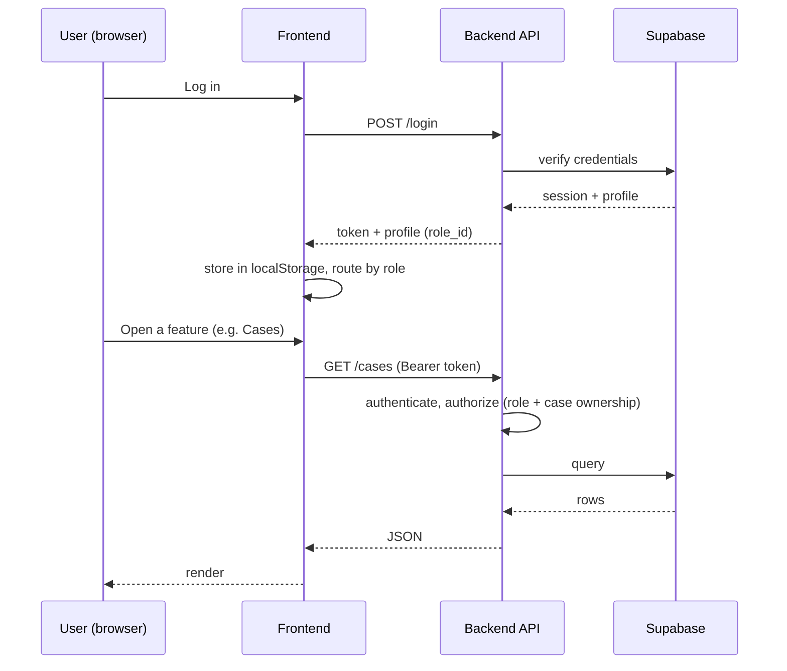
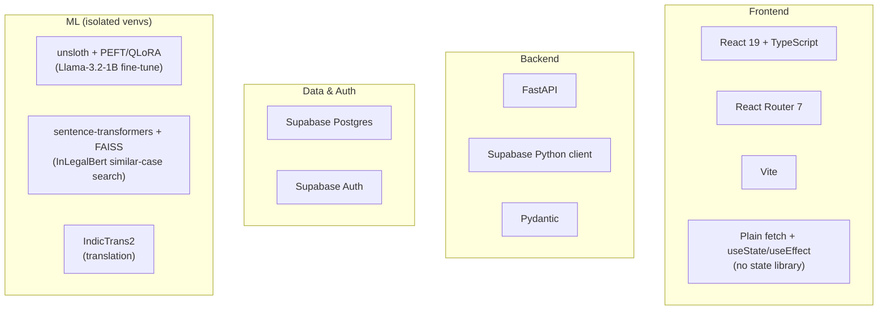

# LexFlow — High-Level Design

System-level view: who uses it, the major subsystems, how they fit together, and the tech stack. For endpoint-level detail, auth internals, data model, and ML pipeline mechanics, see [`LLD.md`](./LLD.md).

---

## 1. System Context

---

## 2. Major Subsystems

---

## 3. Capability Overview by Role

---

## 4. High-Level Request Flow

---

## 5. Tech Stack

---

## 6. Design Principles Observed

- **Thin backend, isolated ML** — the API process has zero ML dependencies; all inference runs out-of-process in dependency-isolated venvs, invoked via subprocess.
- **Two-layer authorization** — role check (what a user is) is separate from object-level ownership check (which cases they may touch), added after an audit found the gap.
- **Supabase as the single source of truth** — no local DB; Postgres + Auth both come from Supabase.
- **No shared frontend state layer** — session and data fetching are handled per-page/per-view rather than through a central store; documented as a current tradeoff, not a constraint of the design.
