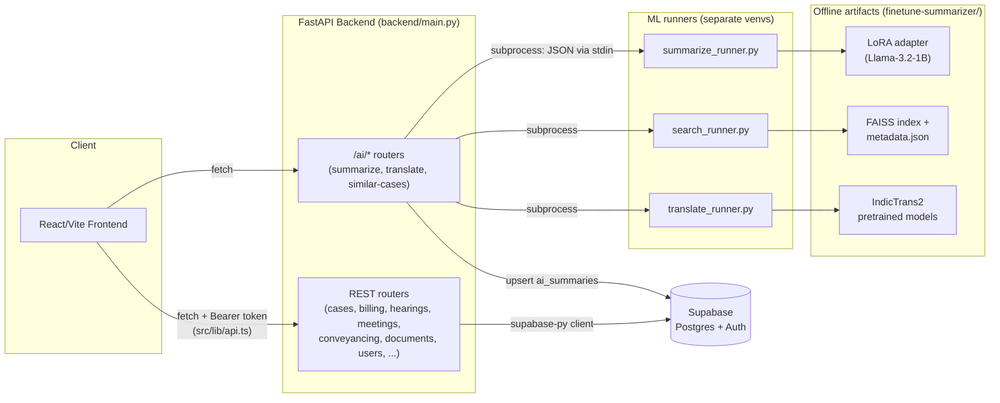
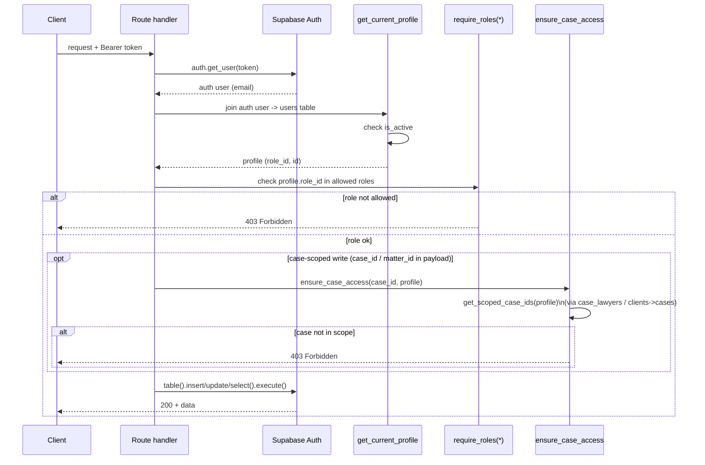
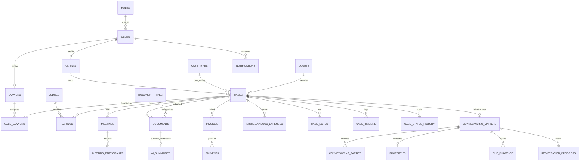
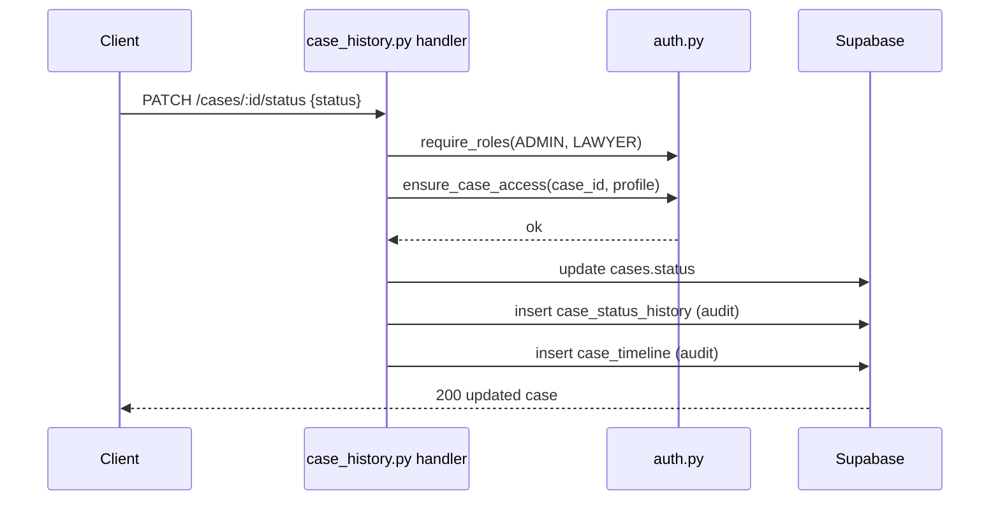
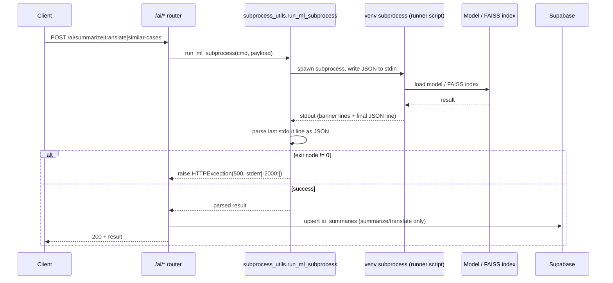
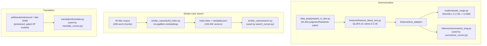
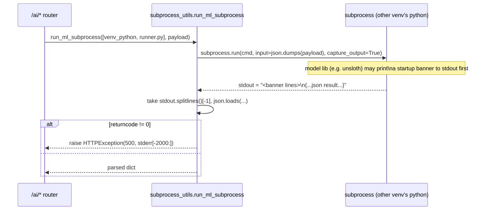
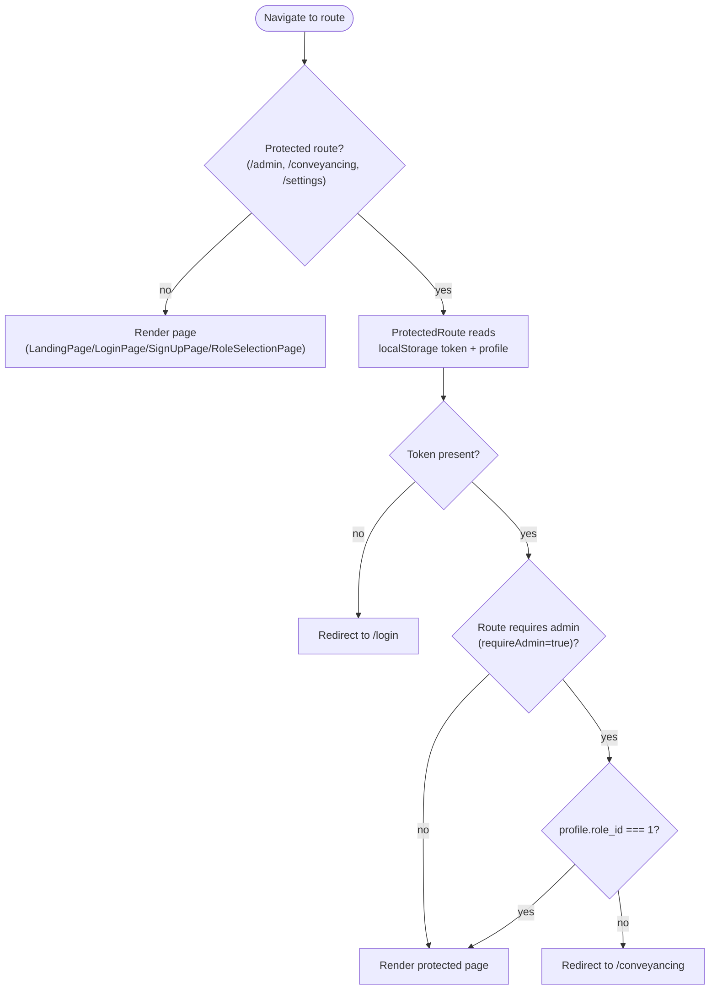
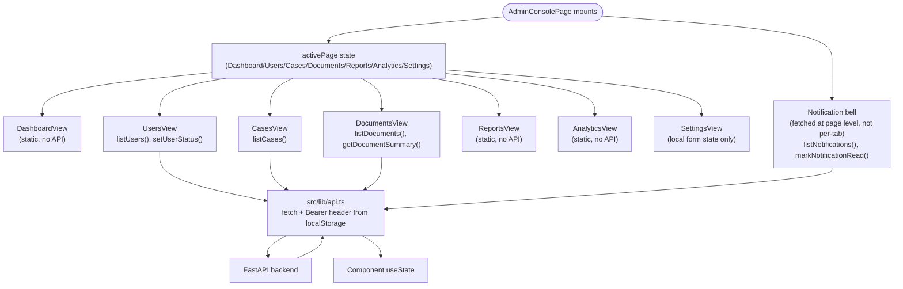

# LexFlow — Low-Level Design

A legal-tech case & conveyancing management system: React/Vite frontend, FastAPI backend on Supabase (Postgres + Auth), and an offline-trained ML subsystem (summarization, translation, similar-case search) invoked from the backend via subprocess.

Diagrams are best-effort reconstructions from the current codebase, not a spec — where the code takes a known shortcut, it's called out as a **current tradeoff** rather than presented as intended design.

---

## 1. System Architecture

---

## 2. Backend Module Map

```mermaid
graph TD
    subgraph AuthUsers["Auth / Users"]
        auth["auth.py\nget_current_user, get_current_profile,\nrequire_roles, ensure_case_access"]
        users["users.py\nGET /users, PATCH /users/:id/status"]
        mainpy["main.py\nPOST /signup, /login, /forgot-password"]
    end

    subgraph CaseDomain["Cases / Billing / History"]
        cases["cases.py\nGET /cases"]
        billing["billing.py\ninvoices, payments, expenses"]
        history["case_history.py\nnotes, timeline, status-history"]
    end

    subgraph Scheduling["Hearings / Meetings"]
        hearings["hearings.py"]
        meetings["meetings.py"]
    end

    conv["conveyancing.py\nmatters, due-diligence, progress"]
    docs["documents.py\nlist docs, fetch AI summary"]
    notif["notifications.py"]
    ref["reference.py\nroles, case_types, courts, judges"]

    subgraph MLRoutes["ML (/ai/*)"]
        summarize["ml/summarize.py"]
        translate["ml/translate.py"]
        similar["ml/similar_cases.py"]
    end

    DB[("Supabase tables")]

    mainpy --> DB
    auth --> DB
    users --> DB
    cases --> DB
    billing --> DB
    history --> DB
    hearings -->|"syncs cases.next_hearing_date"| DB
    meetings --> DB
    conv --> DB
    docs --> DB
    notif --> DB
    ref --> DB
    summarize -->|"upsert ai_summaries"| DB
    translate -->|"upsert ai_summaries"| DB
    similar -.->|"read-only, no DB write"| DB
```

---

## 3. Auth + RBAC + Object-Level Authorization

Two layers, added in separate commits: role-based gating (`ed64545`) and per-object ownership checks (`57603fa`) — role alone doesn't prove a lawyer/client owns the specific case they're writing to.

---

## 4. Data Model (inferred from query field names — not a live schema dump)

---

## 5. Case-Scoped Write Flow (e.g. `PATCH /cases/:id/status`)

---

## 6. ML Runtime Flows (`/ai/summarize`, `/ai/translate`, `/ai/similar-cases`)

Same shape for all three — one subprocess call into a separate venv, with a **model reload on every request** (noted `ponytail:` in `summarize.py` / `translate.py` / `similar_cases.py` — current tradeoff, upgrade path is a long-lived worker process).

---

## 7. Offline ML Pipelines (`finetune-summarizer/`)

---

## 8. Cross-Venv Subprocess Contract

Backend's own venv has none of unsloth/faiss/IndicTrans2 (incompatible with each other and with the backend's deps) — `backend/requirements.txt` has no ML libraries at all. ML always runs out-of-process in a dedicated venv.

Covered by `backend/ml/test_subprocess_utils.py` (bare-JSON, banner-then-JSON, and nonzero-exit cases, via mocked `subprocess.run`).

---

## 9. Frontend Routing & Auth Guard

**Current tradeoff:** session (`token` + `profile`) lives only in `localStorage`, read via a duplicated `loadProfile()`-style helper in both `ProtectedRoute.tsx` and `AdminConsolePage.tsx` — no shared auth context/hook.

---

## 10. Frontend Data Flow (Admin Console)

---

## Known current tradeoffs (called out in code, not fixed here)

- ML models/FAISS index reload on **every** request — no persistent worker (`summarize.py`, `translate.py`, `similar_cases.py`).
- Frontend session state is `localStorage`-only, read via duplicated helpers instead of a shared context/hook.
- `subprocess_utils` trusts the **last line** of stdout as the JSON payload — fragile if a runner script ever prints after its result line.
